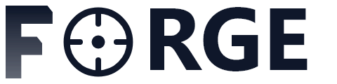

<div align="center">



### **The Core Data Platform**

*Scalable compute. Reliable orchestration. Governed analytics.*

[](https://learn.microsoft.com/en-us/azure/azure-resource-manager/bicep/) [](https://azure.microsoft.com/en-us/products/kubernetes-service) [](https://spark.apache.org) [](https://trino.io) [](https://airflow.apache.org) [](https://delta.io)

<br/>

[**Architecture**](#architecture) · [**Quick Start**](#quick-start) · [**Clusters**](#clusters) · [**Lakehouse**](#lakehouse) · [**Developer Guide**](#developer-guide)

</div>

---

## What is Forge?

Forge is the core data engineering platform that handles everything from raw ingestion to governed, serving-ready data — giving downstream consumers clean, validated, and lineage-tracked data to work with.

```
┌─────────────────────────────────────────────────────────────┐
│                         Forge                              │
│                                                              │
│  ┌─────────────────┐    ┌──────────────────────────────┐    │
│  │  Compute Cluster │    │   Orchestration Cluster       │    │
│  │                  │    │                              │    │
│  │  • Apache Spark  │    │  • Apache Airflow            │    │
│  │  • Spark Connect │    │  • Data Quality Framework    │    │
│  │  • Trino         │    │  • OpenLineage / Marquez     │    │
│  └─────────────────┘    │  • Observability Stack        │    │
│           │              │  • Developer Portal           │    │
│           ▼              └──────────────────────────────┘    │
│  ┌─────────────────────────────────────────────────────┐    │
│  │              ADLS Gen2 Lakehouse                     │    │
│  │   bronze/ → silver/  →  gold/                       │    │
│  └─────────────────────────────────────────────────────┘    │
└─────────────────────────────────────────────────────────────┘
                              │
                              ▼
              ┌───────────────────────────┐
              │    Downstream Consumers   │
              │  (Analytics / ML / Apps)  │
              └───────────────────────────┘
```

---

## Architecture

### Dual-Cluster Design

Forge separates **compute** from **orchestration** into two independent AKS clusters. This ensures:

- **Minimal blast radius** — a compute outage doesn't affect orchestration and vice versa
- **Independent scaling** — Spark workers scale without impacting Airflow schedulers
- **Clean ownership** — data engineers own compute; platform engineers own orchestration

| Cluster | Purpose | Key Components |
|---------|---------|----------------|
| `forge-compute` | Run Spark jobs and Trino queries | Spark Operator, Spark Connect, Trino |
| `forge-orchestration` | Schedule, validate, observe | Airflow, Marquez, Azure Monitor Agent |

### Lakehouse Zones

All data lives in ADLS Gen2 with hierarchical namespace, structured into four Medallion zones:

| Zone | Path | Format | Purpose |
|------|------|--------|---------|
| Bronze | `abfss://bronze@<account>.dfs.core.windows.net/` | Parquet / native | Immutable source data, append-only |
| Silver | `abfss://silver@<account>.dfs.core.windows.net/` | Delta Lake | Cleaned, validated, schema-enforced |
| Gold | `abfss://gold@<account>.dfs.core.windows.net/` | Delta Lake | Aggregated, SLA-governed, consumer-ready |
| Sandbox | `abfss://sandbox@<account>.dfs.core.windows.net/` | Any | Per-user experimentation, 30-day TTL, no lineage |

---

## Quick Start

### Prerequisites

- Azure CLI (`az`) authenticated with Owner role on target subscription
- kubectl, helm 3.x
- Python 3.11+

### 1. Provision Infrastructure

```bash
# Edit infra/bicep/environments/dev/main.bicepparam with your subscription/tenant IDs
az deployment sub create \
  --location northcentralus \
  --template-file infra/bicep/environments/dev/main.bicep \
  --parameters @infra/bicep/environments/dev/main.bicepparam \
  --name forge-dev
```

### 2. Deploy Compute Cluster Apps

```bash
kubectl config use-context forge-compute-dev
helm upgrade --install spark-operator infra/helm/compute/spark-operator -n spark-system --create-namespace
helm upgrade --install spark-connect infra/helm/compute/spark-connect -n spark-system
helm upgrade --install trino infra/helm/compute/trino -n trino --create-namespace
```

### 3. Deploy Orchestration Cluster Apps

```bash
kubectl config use-context forge-orchestration-dev
helm upgrade --install airflow infra/helm/orchestration/airflow -n airflow --create-namespace
helm upgrade --install marquez infra/helm/orchestration/marquez -n lineage --create-namespace
helm upgrade --install observability infra/helm/orchestration/observability -n monitoring --create-namespace
```

### 4. Connect VS Code to Spark Connect

```python
from pyspark.sql import SparkSession

spark = SparkSession.builder \
    .remote("sc://<spark-connect-lb-ip>:15002") \
    .getOrCreate()

df = spark.read.parquet("abfss://raw@<account>.dfs.core.windows.net/my-dataset/")
df.show()
```

---

## Clusters

### Compute Cluster (`forge-compute`)

| Component | Version | Namespace |
|-----------|---------|-----------|
| Spark Operator | 1.4.x | `spark-system` |
| Spark Connect | 3.5.x | `spark-system` |
| Trino | 438 | `trino` |

### Orchestration Cluster (`forge-orchestration`)

| Component | Version | Namespace |
|-----------|---------|-----------|
| Apache Airflow | 2.9.x | `airflow` |
| Marquez (OpenLineage) | 0.47.x | `lineage` |
| Azure Monitor / Container Insights | AKS add-on (managed) | `kube-system` (AMA DaemonSet) |
| Azure Managed Grafana | Azure-native service | Azure-hosted |
| Azure Log Analytics Workspace | Azure-native service | Azure-hosted |

---

## Developer Guide

### Writing a Spark Job

Place your Spark application under `compute/spark/jobs/`. Submit via `SparkApplication` CRD:

```yaml
apiVersion: sparkoperator.k8s.io/v1beta2
kind: SparkApplication
metadata:
  name: my-job
  namespace: spark-jobs
spec:
  type: Python
  pythonVersion: "3"
  mode: cluster
  image: "forge.azurecr.io/spark:4.1"
  mainApplicationFile: "abfss://code@<account>.dfs.core.windows.net/jobs/my_job.py"
```

### Writing an Airflow DAG

Drop your DAG file into `orchestration/airflow/dags/`. Use the built-in templates:

```python
from dags.ingestion.raw_ingestion_template import build_raw_ingestion_dag

dag = build_raw_ingestion_dag(
    dag_id="ingest_sales_orders",
    source_config={"type": "blob", "path": "abfss://raw@.../sales/orders/"},
    schedule="@daily",
)
```

### Running Data Quality Checks

```python
from forge.dq.sdk import DQRunner, load_ruleset

ruleset = load_ruleset("orchestration/dq/rules/sales_orders.yaml")
runner = DQRunner(spark=spark, ruleset=ruleset)
report = runner.run(df)

if not report.passed:
    raise ValueError(f"DQ failed: {report.summary}")
```

---

## Repository Layout

```
Forge/
├── infra/                    # Infrastructure as Code
│   ├── bicep/                # Azure resources (AKS, ADLS, KV, networking)
│   ├── helm/                 # Helm charts for all platform components
│   └── pipelines/            # Azure DevOps pipeline YAML definitions
├── orchestration/            # Orchestration layer
│   ├── airflow/              # DAGs, operators, hooks
│   ├── dq/                   # Data Quality framework
│   └── lineage/              # OpenLineage integration
├── portal/                   # Developer Portal
│   ├── backend/              # FastAPI API (pipelines, datasets, DQ, lineage, cost)
│   └── frontend/             # Next.js UI
├── sdk/                      # Platform SDK (Python + CLI)
├── docs/                     # Architecture docs and guides
└── scripts/                  # Bootstrap and CI utilities
```

---

## Consumers of the Gold Layer

Forge produces governed data in the gold layer. Downstream consumers — analytics platforms, ML pipelines, and applications — read from the gold layer and trust it as their source of truth.

| | Forge |
|--|---------|
| **Audience** | Data engineers, platform team |
| **Purpose** | Build, move, validate, govern data |
| **Interface** | Developer Portal, VS Code, CLI |
| **Data flow** | Produces governed data in gold layer |
