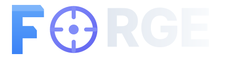

<div align="center">

<picture>
  <source media="(prefers-color-scheme: dark)" srcset="docs/reference/forge-logo.svg">
  <source media="(prefers-color-scheme: light)" srcset="docs/reference/forge-logo-light.svg">
  
</picture>

<br/>

### **The Core Data Platform**

*Scalable compute. Reliable orchestration. Governed analytics.*

[](https://github.com/PruthviProdduturi/Forge/actions/workflows/ci.yml) [](LICENSE)

[](https://learn.microsoft.com/en-us/azure/azure-resource-manager/bicep/) [](https://azure.microsoft.com/en-us/products/kubernetes-service) [](https://spark.apache.org) [](https://trino.io) [](https://airflow.apache.org) [](https://delta.io)

<br/>

[**Architecture**](#architecture) · [**Quick Start**](#quick-start) · [**Clusters**](#clusters) · [**Lakehouse**](#lakehouse) · [**Developer Guide**](#developer-guide) · [**Contributing**](CONTRIBUTING.md)

</div>

---

## Documentation

| Document | What it covers |
|----------|----------------|
| [**Platform Brief**](docs/platform-brief.md) | One-page summary — what Forge is, what it solves, all components, security posture, where to start |
| [**Platform Design Reference**](docs/DESIGN.md) | Principles, two-cluster model, all layers, developer workflow, delivery lifecycle |
| [**Architecture Deep-Dives**](docs/README.md) | 14 numbered docs covering every component (infra, networking, security, compute, DQ, lineage, observability…) |
| [**Implementation Guides**](docs/implementation/01-acr-setup.md) | Step-by-step provisioning from zero |
| [**Developer Experience Guide**](docs/guides/developer-experience.md) | Cluster access (AAD), VS Code + Spark Connect setup, DAG authoring, DQ rules |

---

## What is Forge?

Forge is the core data engineering platform that handles everything from raw ingestion to governed, serving-ready data — giving downstream consumers clean, validated, and lineage-tracked data to work with.

```
┌─────────────────────────────────────────────────────────────┐
│                            Forge                            │
│                                                             │
│  ┌──────────────────┐   ┌──────────────────────────────┐    │
│  │  Compute Cluster │   │  Orchestration Cluster       │    │
│  │                  │   │                              │    │
│  │  • Apache Spark  │   │  • Apache Airflow            │    │
│  │  • Spark Connect │   │  • Data Quality Framework    │    │
│  │  • Trino         │   │  • OpenLineage / Purview     │    │
│  └──────────────────┘   │  • Observability Stack       │    │
│           │             │  • Developer Portal          │    │
│           ▼             └──────────────────────────────┘    │
│  ┌─────────────────────────────────────────────────────┐    │
│  │              ADLS Gen2 Lakehouse                    │    │
│  │   bronze/ → silver/  →  gold/                       │    │
│  └─────────────────────────────────────────────────────┘    │
└─────────────────────────────────────────────────────────────┘
                              │
                              ▼
              ┌───────────────────────────┐
              │    Downstream Consumers   │
              │  (Analytics / ML / Apps)  │
              └───────────────────────────┘
```

---

## Architecture

### Dual-Cluster Design

Forge separates **compute** from **orchestration** into two independent AKS clusters. This ensures:

- **Minimal blast radius** — a compute outage doesn't affect orchestration and vice versa
- **Independent scaling** — Spark workers scale without impacting Airflow schedulers
- **Clean ownership** — data engineers own compute; platform engineers own orchestration

| Cluster | Purpose | Key Components |
|---------|---------|----------------|
| `forge-compute` | Run Spark jobs and Trino queries | Spark Operator, Spark Connect, Trino |
| `forge-orchestration` | Schedule, validate, observe | Airflow, Microsoft Purview (OpenLineage), Azure Monitor Agent |

### Lakehouse Zones

All data lives in ADLS Gen2 with hierarchical namespace, structured into four Medallion zones:

| Zone | Path | Format | Purpose |
|------|------|--------|---------|
| Bronze | `abfss://bronze@<account>.dfs.core.windows.net/` | Delta Lake | Immutable source data, append-only |
| Silver | `abfss://silver@<account>.dfs.core.windows.net/` | Delta Lake | Cleaned, validated, schema-enforced |
| Gold | `abfss://gold@<account>.dfs.core.windows.net/` | Delta Lake | Aggregated, SLA-governed, consumer-ready |
| Sandbox | `abfss://sandbox@<account>.dfs.core.windows.net/` | Any | Per-user experimentation, 28-day TTL, no lineage |

---

## Quick Start

### Prerequisites

- Azure CLI (`az`) authenticated with Owner role on target subscription
- kubectl, helm 3.x
- Python 3.11+

### 1. Provision Infrastructure

```bash
# Edit infra/bicep/environments/dev/main.bicepparam with your subscription/tenant IDs
az deployment sub create \
  --location northcentralus \
  --template-file infra/bicep/environments/dev/main.bicep \
  --parameters @infra/bicep/environments/dev/main.bicepparam \
  --name forge-dev
```

### 2. Deploy Compute Cluster Apps

```bash
kubectl config use-context forge-compute-dev
helm upgrade --install spark-operator infra/helm/compute/spark-operator -n spark-system --create-namespace
helm upgrade --install spark-connect infra/helm/compute/spark-connect -n spark-system
helm upgrade --install trino infra/helm/compute/trino -n trino --create-namespace
```

### 3. Deploy Orchestration Cluster Apps

```bash
kubectl config use-context forge-orchestration-dev
helm upgrade --install airflow infra/helm/orchestration/airflow -n airflow --create-namespace
helm upgrade --install observability infra/helm/orchestration/observability -n monitoring --create-namespace
```

### 4. Connect VS Code to Spark Connect

```python
from pyspark.sql import SparkSession

spark = SparkSession.builder \
    .remote("sc://<spark-connect-lb-ip>:15002") \
    .getOrCreate()

df = spark.read.format("delta").load("abfss://bronze@<account>.dfs.core.windows.net/my-dataset/v1/")
df.show()
```

---

## Clusters

### Compute Cluster (`forge-compute`)

| Component | Version | Namespace |
|-----------|---------|-----------|
| Spark Operator | 2.5.0 | `spark-system` |
| Spark Connect | 4.1.1 | `spark-system` |
| Trino | 480 | `trino` |
| Hive Metastore | 4.0.0 | `trino` |

### Orchestration Cluster (`forge-orchestration`)

| Component | Version | Namespace |
|-----------|---------|-----------|
| Apache Airflow | 3.1.8 | `airflow` |
| Microsoft Purview | Managed service (org-wide license) | Azure-hosted |
| Azure Monitor / Container Insights | AKS add-on (managed) | `kube-system` (AMA DaemonSet) |
| Azure Managed Grafana | Azure-native service | Azure-hosted |
| Azure Log Analytics Workspace | Azure-native service | Azure-hosted |

---

## Developer Guide

### Writing a Pipeline

Pipelines are defined in a single TypeScript manifest (`.forge.ts`). The CLI generates the Spark job, Airflow DAG, and DQ rules from that manifest.

```bash
# 1. Create a manifest stub
forge init --name my_job --layer bronze

# 2. Edit the manifest: src/{project}/manifests/my_job.forge.ts

# 3. Generate the job, DAG, and DQ rules
forge generate --job my_job --manifest-dir src/{project}/manifests --dir .

# 4. Fill in business logic between FORGE:BUSINESS_LOGIC:START / END

# 5. Deploy
FORGE_ENV="dev" OWNER_ALIAS="DSEng" bash infra/scripts/sync-jobs.sh --job my_job
```

`sync-jobs.sh` uploads the Spark job to `ADLS code/spark/jobs/`, the DQ rules to `ADLS code/dq/rules/`, and the DAG file is picked up by git-sync within 30 seconds.

### How DAGs are generated

Each manifest produces a DAG that uses platform operators — DAG authors never write SparkApplication YAML:

```python
from forge_airflow.operators import ForgeSparkOperator, ForgeDqGateOperator

ingest = ForgeSparkOperator(
    task_id="ingest",
    job="my_job_bronze",       # matches Spark .py file name in ADLS
    layer="bronze",
    env_vars={"PARTITION_DATE": "{{ ds }}"},
)

dq_gate = ForgeDqGateOperator(
    task_id="dq_gate",
    job="my_job_bronze",       # reads dq/rules/my_job_bronze.yaml from ADLS
    layer="bronze",
    table="bronze.my_job",
)

ingest >> dq_gate
```

`ForgeSparkOperator` reads platform config (`spark_image`, `storage_account`, `aad_tenant_id`, `spark_mi_client_id`) from Airflow Variables at parse time and builds the full `SparkApplication` YAML internally.

### Cross-DAG dependencies

Downstream DAGs declare `triggeredBy` in the manifest instead of the upstream DAG pushing triggers. The generated DAG uses `ExternalTaskSensor`:

```python
# silver DAG — waits for bronze to complete each day
wait_for_bronze = ExternalTaskSensor(
    task_id="wait_for_bronze",
    external_dag_id="my_job_bronze_dag",
    external_task_id=None,          # waits for the entire DAG run
    mode="reschedule",
    timeout=timedelta(hours=8),
    poke_interval=120,
)
```

### Data Quality

DQ rules live in `dq/{name}.yaml` (generated once, then yours to extend). The DQ gate runs as a dedicated Spark job (`forge_dq_gate.py`) via `ForgeDqGateOperator` — it reads the rules from ADLS at runtime. `CRITICAL` violations raise `DQCriticalFailureError` and fail the Airflow task.

---

## Repository Layout

```
Forge/
├── infra/                    # Infrastructure as Code
│   ├── bicep/                # Azure resources (AKS, ADLS, KV, networking)
│   ├── helm/                 # Helm charts for all platform components
│   └── pipelines/            # Azure DevOps pipeline YAML definitions
├── orchestration/            # Orchestration layer
│   ├── airflow/              # DAGs, operators, hooks
│   ├── dq/                   # Data Quality framework
│   └── lineage/              # OpenLineage integration
├── portal/                   # Developer Portal
│   ├── backend/              # FastAPI API (pipelines, datasets, DQ, lineage, cost)
│   └── frontend/             # Next.js UI
├── sdk/                      # Platform SDK (Python + CLI)
├── docs/                     # Architecture docs and guides
└── scripts/                  # Bootstrap and CI utilities
```

---

## Consumers of the Gold Layer

Forge produces governed data in the gold layer. Downstream consumers — analytics platforms, ML pipelines, and applications — read from the gold layer and trust it as their source of truth.

| | Forge |
|--|---------|
| **Audience** | Data engineers, platform team |
| **Purpose** | Build, move, validate, govern data |
| **Interface** | Developer Portal, VS Code, CLI |
| **Data flow** | Produces governed data in gold layer |
